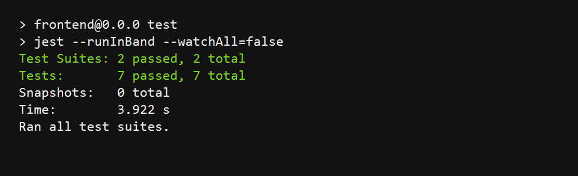

Full-Stack E-Commerce App

Developed a scalable end-to-end ecommerce application, Mobile friendly  using React 19 SPA, TypeScript, TanStack Query, and Express.js
Built responsive and reusable UI components with optimized API data fetching, caching, and synchronization
Implemented REST APIs and improved application reliability through unit and integration testing with Jest
Automated CI/CD pipelines using GitHub Actions for testing, build, and deployment workflows
Deployed backend on AWS EC2 and frontend on Vercel for production

 Highlights

- TanStack Query Improves UX because the app feels fast and consistent 

- Jest covers unit and integration test flows, including product rendering, cart updates, checkout, and payment confirmation.
  
- Express REST API provides products, cart items, delivery options, orders, and payment summary endpoints.
  
- GitHub Actions  are included to run tests automatically.

Tech Stack

- Frontend: React 19, TypeScript,  React Router, TanStack Query
- Backend: Node.js, Express.js
- Testing: Jest 
- CI/CD: GitHub Actions

 Project Structure

```text
Full-stack-e-commerce-app-copy/
  Backend/
  frontend/
  .github/workflows/test.yml
 
  README.md
```

Deployment:

- Backend: Deployed on AWS EC2
- Frontend: Deployed on Vercel


Frontend runs on `http://localhost:5173` and proxies `/api` requests to the backend on `http://localhost:3000`.

Testing

```bash
cd frontend
npm test -- --watchAll=false
```

Current result:

- Test suites: 2 passed, 2 total
- Tests: 7 passed, 7 total




 API:

Main endpoints:

```text
GET    /api/products
GET    /api/cart-items
POST   /api/cart-items
PUT    /api/cart-items/:productId
DELETE /api/cart-items/:productId
GET    /api/delivery-options
POST   /api/orders
GET    /api/payment-summary
```

